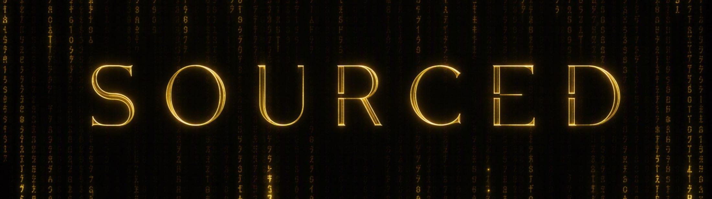

# SOURCED

**Can you stand behind your output?**

Seven checks on any artefact that contains model output.
**S**ourced · **O**pposed · **U**nderwritten · **R**ecorded · **C**onstrained · **E**valuated · **D**isclosed

Everything a language model produces is confabulation. Generating the most probable next token, over
and over, is not a defect in the machine, it is the machine. So the output is never the trustworthy
part, and no amount of careful prompting makes it so.

What can be trusted is what you attach to it: a sentence someone actually retrieved, a name against a
decision, a record of what was in front of it, a test with a known answer, a disclosure a reader can
act on. SOURCED is seven checks that attach those things.

Governing what work says is not new. It used to happen in forums, in review boards, and in a second
pair of eyes. AI did not remove the need for it. It removed the friction those things quietly relied
on, and it broke the assumption underneath all of them, which was that somebody reads every output.

**This is not a silver bullet, and nothing here makes a model correct.** The checks mitigate a
specific set of risks quickly and cheaply. The larger value is the framework itself, and what you do
with it once you stop applying it by hand: wiring the seven into the systems and workflows that
produce work at a volume nobody reads.

## The two faces

The framework has two faces and they must not be collapsed.

| Face | What it is |
|---|---|
| **The seven problems** | Human failure modes, older than the tool, stated as the thing that hurts. Presented with **no letters attached** |
| **SOURCED** | The seven checks that answer them, one each |

Anything that shows the letters while describing the problem has given away the only thing that
makes the framework land: the reader recognising the problem as theirs before being handed a name
for the fix.

## The seven

| | Check | Answers the problem | Human failure mode |
|---|---|---|---|
| **S** | Sourced | Nobody can tell where any of it came from. | Fluency bias |
| **O** | Opposed | Nothing ever argued back. | Confirmation bias, plus sycophancy |
| **U** | Underwritten | If it is wrong, no name is on it. | Diffusion of responsibility |
| **R** | Recorded | The reasoning was never written down (while it happened). | Narrative fallacy |
| **C** | Constrained | There is no safety net. Nothing stops it doing the wrong thing. | Normalisation of deviance |
| **E** | Evaluated | The system changed since it was checked. | Frozen baseline |
| **D** | Disclosed | The reader cannot tell what was checked, or by whom. | Automation bias |

**Four of the seven have no manual version at volume: S, R, C and E.** That is the argument for
building them into systems rather than teaching them as a discipline.

## The output: a provenance block

```
Attribution:  Who authored it, and that AI tools assisted, in one sentence.
Accountable:  The named person who answers for it.
Limitations:  What is not backed, and how far each claim is from its source.
References:   What backs it, where it lives, and how it can be checked.
```

**Every line must either make a limit transparent, or let the reader go and check something.** A line
that does neither is a motherhood statement and comes out. See [docs/provenance-block.md](docs/provenance-block.md).

## What is here

| Path | What it is |
|---|---|
| `prompts/` | **Start here if you want something you can use in five minutes.** Four paste-ready prompts: the one-pass audit (everything that runs without fetching, in one prompt), plus the Claim Sweep, the Source Check and the Four Lines separately. No install, any model |
| `skills/sourced/` | The skill and its tools. Capture and re-check a source with `sourced.py`; derive a claim's label with `sourced_status.py`; find claims used in more than one document with `shared_claims.py`. The checkers: `sophistication.py` (levels), `kinds.py`, `dimensions.py` (conditions and the dimension registry), `conflicts.py`, `boundary.py`, `vocabulary.py`, and the gate `integrate.py` |
| `docs/examples/` | One sidecar at schema 1.7 with every optional field populated, so the format can be read rather than described |
| `docs/framework.md` | The framework in full: both faces, what each check requires at each scale, the stance, the regulatory mapping |
| `docs/provenance-block.md` | The four labels, the test that governs them, and what was rejected |
| `docs/data-governance.md` | The seven mapped onto the data-governance disciplines that already exist |
| `docs/sidecar.md` | The `.sourced` file: schema, and why it is deliberately thin |
| `docs/vocabulary-map.md` | The three-way map of SOURCED, the claim store's Claim Record v1 and Publish's ledger: the exact matches, the gaps this repo cannot answer, and the ten places the three systems disagree. It resolves none of them |
| `docs/philosophy.md` | The positions the framework rests on, why they are shaped that way, and what moved them. Read this before changing a rule |
| `scripts/check-no-leaks.py` | Public-repo guard: file contents on commit, commit authorship on push. Enable with `git config core.hooksPath .githooks` |

## Using the tools

```bash
# is any claim used in more than one document, and have they drifted apart?
python3 skills/sourced/shared_claims.py            # scans the working directory
SOURCED_ROOT=/path/to/repo python3 skills/sourced/shared_claims.py

# does every sidecar's stored label match what the rule derives?
python3 skills/sourced/sourced_status.py <file>.sourced ...

# both carry a runnable self-check and no dependencies
python3 skills/sourced/shared_claims.py --self-check
python3 skills/sourced/sourced_status.py
```

`shared_claims.py` exits non-zero on `DIVERGED`, so it can sit in a pre-publish check.

Two things here **are** gates, and both run before a statement ships:

```bash
python3 skills/sourced/integrate.py <file>.sourced   # refuse a delivery hiding a disagreement
```

Everything else reports rather than refuses, and it should stay that way: the useful output is a
person reading two sentences.

## What a sidecar looks like

`<artefact>.sourced` sits beside the artefact. This is one claim carrying everything schema 1.6
holds. Every one of the optional parts is optional, and a sidecar written before them still
validates.

```json
{
  "sourced": "1.6",
  "artefact": { "path": "sky-deck.html", "sha256": "…", "producedAt": "2026-08-29" },
  "claims": [
    { "id": "c1", "statement": "The sky is blue.", "status": "sourced",
      "kind": "empirical",
      "level": 1,
      "challenged": "holds-with-boundary",
      "evidence": ["e1", "e2", "e3"],
      "owner": { "name": "A. Ramsden", "since": "2026-08-29",
                 "checked": "Read the 1899 paper in full and confirmed the exponent." },
      "holds_when": [
        { "id": "k1", "dimension": "air quality", "value": "clean",
          "basis": "stated-in-source", "status": "confirmed",
          "level": 1, "finer": "k2" },
        { "id": "k2", "dimension": "particulate", "value": "below 6 ppm", "basis": "tested",
          "level": 3, "coarser": "k1" } ],
      "fails_when": [
        { "id": "k4", "dimension": "sun angle", "value": "near the horizon",
          "basis": "stated-in-source", "status": "confirmed" } ],
      "replaced_by": { "claim": "c5" },
      "unknown_region": "Nobody in this evidence looked at dusk under haze." },

    { "id": "c3", "kind": "position", "status": "inferred",
      "statement": "Recording a boundary is more useful than recording a verdict.",
      "falsifier": "A team that records verdicts finds the same errors as one that records boundaries." },

    { "id": "c5", "kind": "empirical", "status": "sourced", "challenged": "holds",
      "statement": "Near the horizon the sky is red, because the light travels through more air.",
      "holds_when": [ { "dimension": "sun angle", "value": "near the horizon",
                        "basis": "stated-in-source", "status": "confirmed" } ],
      "unknown_region": "Nobody in this evidence looked at the horizon under haze." } ],

  "evidence": [
    { "id": "e1", "url": "https://example.org/rayleigh", "locator": "p. 178",
      "quote": "Scattering varies as the inverse fourth power of wavelength.",
      "retrievedAt": "2026-08-29", "sha256": "…", "textSha256": "…",
      "originGroup": "textbook:rayleigh",
      "supports": { "claim": "c1", "direction": "for" },
      "conditions": [ { "dimension": "air quality", "value": "clean", "basis": "tested" } ] },
    { "id": "e2", "url": "https://example.org/haze-study", "locator": "p. 12",
      "quote": "Under haze the overhead sky reads grey rather than blue.",
      "retrievedAt": "2026-08-29", "originGroup": "journal:haze",
      "supports": { "claim": "c1", "direction": "against" },
      "conditions": [ { "dimension": "air quality", "value": "hazy", "basis": "observed" } ] },
    { "id": "e3", "url": "https://example.org/dusk-survey", "locator": "p. 4",
      "quote": "Overhead the sky stayed blue through the afternoon, and at dusk it did not.",
      "retrievedAt": "2026-08-29", "originGroup": "journal:dusk",
      "supports": { "claim": "c1", "direction": "mixed" },
      "conditions": [ { "dimension": "sun angle", "value": "high",
                        "basis": "stated-in-source", "status": "monitoring" } ] } ],

  "conflicts": [
    { "id": "x1", "claim": "c1",
      "between": [ { "evidence": "e1", "outcome": "for" },
                   { "evidence": "e2", "outcome": "against" } ],
      "dimensions": ["air quality"], "state": "resolved", "resolved_into": "c1" },
    { "id": "x2", "claim": "c1",
      "between": [ { "evidence": "e1", "outcome": "for" }, { "claim": "c5" } ],
      "dimensions": ["sun angle"], "state": "resolved", "resolved_into": "c1" } ],

  "disclosure": { "attribution": "…", "accountable": "…",
                  "limitations": "…", "references": "…" },
  "opposed": { "grade": "cross-model-fresh-thread", "at": "2026-08-29T06:00:00Z", "raised": 3 }
}
```

From 1.3, all optional: `level` with `coarser`/`finer` on a claim **and** on a condition, because a
condition is itself a claim; `kind` (`empirical`, `synthesis`, `position`, `story`), where a position
or a story must carry a `falsifier` and a story must also name its `witness`; conditions as
`{dimension, value, basis}` rather than `{condition, basis}`, with the old shape still reading;
`supports` on an evidence row, saying which claim it votes on and which way; and `conflicts[]`, where
a disagreement is either `open` with its `unknown_region` named or `resolved` into a claim that
carries a boundary.

New in 1.4, all additive, so a 1.3 or a 1.2 sidecar validates unchanged:

- **A condition's `basis` splits in two.** `basis` is who said it, `status` is how far it has been
  checked. The five old basis words still read and translate, and a formal condition on a claim is
  now one whose `status` is `confirmed`, which is the rule the format always carried.
- **A level has no name.** It is an ordinal and prints as "level 3". The numbers are relative to one
  artefact, so nothing compares a level across two, and re-levelling later is expected.
- **`supports.direction` accepts `mixed`**, a source that supports the claim in one region and
  undermines it in another. It raises no conflict, because it is already saying where the boundary
  is. It raises a boundary prompt instead, which goes silent once the claim carries a boundary.
- **A claim may carry an `owner`**: who answers for it, what they personally checked, and since
  when. `checked` is required, because a signature buys accountability and never accuracy.

New in 1.6, all additive, so a 1.5, a 1.4, a 1.3 or a 1.2 sidecar validates unchanged:

- **A claim may record what the adversarial pass found about it.** `challenged` is
  `not-attempted`, `attempted-unresolved`, `holds`, `holds-with-boundary` or `refuted`, and absent
  reads as `not-attempted`. The artefact-level `opposed` object is unchanged and stays: it says
  which grade of pass ran, and `challenged` says what that pass found about one claim. Neither
  derives from the other.
- **A competing claim is a claim.** A pass hands you a rival claim rather than two sources, so
  the rival lands in `claims[]` with its own evidence, conditions and level. A side of a conflict
  may name it, as `{"claim": "c9"}`, and `replaced_by` may name it too, so what is true instead is
  something a reader can follow rather than a sentence stranded in a string. The evidence-row form
  of a conflict is unchanged.
- **Backing says why it is what it is.** `backing()` returns the number **and** the named reasons,
  in the claim standard's own words. Four are derived from what a sidecar holds: `single-source`,
  `self-interested-source`, `inconsistency` and `imprecision`. `risk-of-bias`, `indirectness` and
  `publication-bias` stay unset, because a sidecar records nothing that answers them, and no
  upgrade is derived at all. Strength is still derived and never stored.

The whole file, with every field populated and every checker's output against it, is in
[docs/examples/](docs/examples/).

## Using the capture tool

```bash
python3 skills/sourced/sourced.py <url> --tier 2      # capture and hash a source
python3 skills/sourced/sourced.py --check             # re-verify everything, report what moved
python3 skills/sourced/sourced.py --self-check        # runnable check, no network
python3 skills/sourced/evals.py                       # the skill's three evals, no network
```

Stdlib only, with `curl` as a fallback, on purpose. A capture tool that needs a dependency tree is a capture tool
that stops working in two years, which is the failure it exists to prevent.

## Where to start

If you arrived from an article and just want the prompts: [`prompts/`](prompts/). Copy one, paste a document under it, done. MIT licensed, no signup.


**Reading it:** [docs/framework.md](docs/framework.md), then
[docs/provenance-block.md](docs/provenance-block.md). Between them they are the whole thing.

**Running it on something:** put the provenance block on your next deliverable. Four lines, and the
only rule that matters is that each one either makes a limit transparent or lets a reader go and
check something. If Limitations is empty, the work has not been examined closely enough.

**Selling it internally:** [docs/data-governance.md](docs/data-governance.md). Six of the seven
checks are disciplines your organisation already staffs and funds. They are pointed at what goes into
a system, and nothing is pointed at what comes out. That is the whole of the ask, and it does not
need a new team.

## Scope, stated rather than implied

SOURCED is **assurance about an artefact's claims**, and about the systems that produce artefacts at
volume. It is one slice of AI governance and it does not pretend to be the whole field.

Against the NIST Generative AI Profile's twelve named risks it answers four fully and one in part.
**What it never asks:** whether the system should exist, whether an output is fair, and whether the
person affected by a decision can contest it. Those questions are real, they matter more than this
one in several settings, and they live elsewhere.

## Using it

Take it. Rename it. Argue with it. The framework is more useful adopted badly than admired intact,
and a version of the seven in your own vocabulary will land better in your organisation than ours
will.

Two things worth keeping if you do fork it:

- **The two faces.** State the problems without the letters. The recognition is the mechanism.
- **The test on the block.** Every line either makes a limit transparent or lets the reader check
  something. Without that test the block silently becomes marketing, which is the failure it exists
  to prevent.

## The bug that shaped two of these tools

Worth reading before trusting any of it, because both stories are about the tool being wrong rather
than the material.

**A correction that had nowhere to go.** One figure was quoted in four different documents. Two were
corrected in a morning; the third still carried the error that afternoon and the fourth was not
found until later, because nothing connected them. The obvious fix is a field on each claim listing
where it is used. That is a field somebody has to maintain, and a maintained cross-reference goes
stale exactly the way the correction did. So `shared_claims.py` derives it instead, from the origin
groups already recorded on the evidence. A derived answer cannot be out of date.

It also reports three tiers rather than two, and the middle one exists because of what the tool
**cannot** do. The first version flagged every wording difference: three alerts, one real. An alert
that is usually noise is an alert people switch off. So `DIVERGED` narrowed to figures. But the
original error carried the *same* figures attached to a different denominator, which no figure
comparison can see. Rather than pretend, `VARIANT` prints the sentences side by side and the
docstring says plainly that this is where that class of error lives. A machine cannot catch it. A
person reading two sentences takes four seconds.

**A pointer counted as evidence.** Migrating an older sidecar to the derived-status rule silently
upgraded three claims from `recalled` to `sourced`. Their evidence rows were pointers: an id and an
origin group, with no quote, no retrieval date and no hash. Nothing had ever been fetched. That is
the precise failure this repository exists to prevent, committed by the code that checks for it.
`derive_status` now counts only rows carrying a `retrievedAt`, and a self-check fails if a bare
pointer ever makes a claim read as sourced again.

Both bugs were found by running the tools on the author's own material, which is the only way
anybody finds this class of bug.

## Contributing

Issues and pull requests are welcome, particularly:

- **A row of the data-governance crosswalk you think is wrong.** It is a reading, not a published
  mapping, and it has never been argued with by a data-governance professional.
- **A tool that closes one of the two open questions** in the landscape work: a retrieval product
  that records a *hash* of what it fetched rather than only a citation, and an evaluation suite that
  can be *triggered by a model or index change* rather than by a schedule.
- **Evidence that the seven checks improve outcomes.** There is none. That is stated in every
  provenance block this project produces, and it is the honest limit of the whole thing.

## Licence

MIT. See [LICENSE](LICENSE). Code and documentation both.

## This page, audited

The framework was run on its own README. The result is in
[README.md.sourced](README.md.sourced): eight load-bearing claims, **two sourced, five inferred,
one recalled**.

```
Attribution:  Authored by the maintainer. AI tools assisted research and
              drafting; all outputs verified.
Accountable:  The maintainer of this repository.
Limitations:  One claim on this page is externally checkable and it is the NIST
              risk count. Everything else is our own reasoning, a crosswalk we
              wrote, or terms recalled from the literature without retrieval.
              The mapping of SOURCED onto the twelve risks is ours and was
              revised once already. No evidence is offered that the seven checks
              improve outcomes.
References:   NIST AI 600-1, retrieved and hashed 25 August 2026,
              sha256 6e73620ab6b64e90.
```

Publishing that ratio is the point. **A framework about provenance without its own provenance would
not be credible.**
